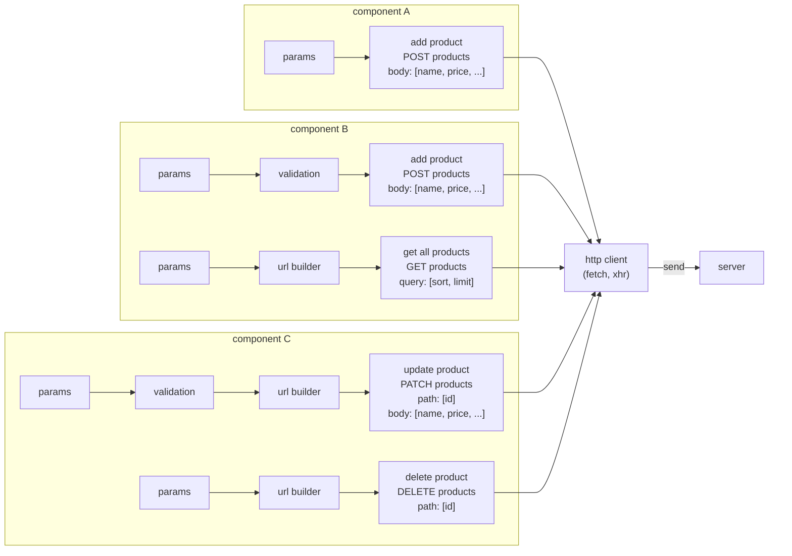
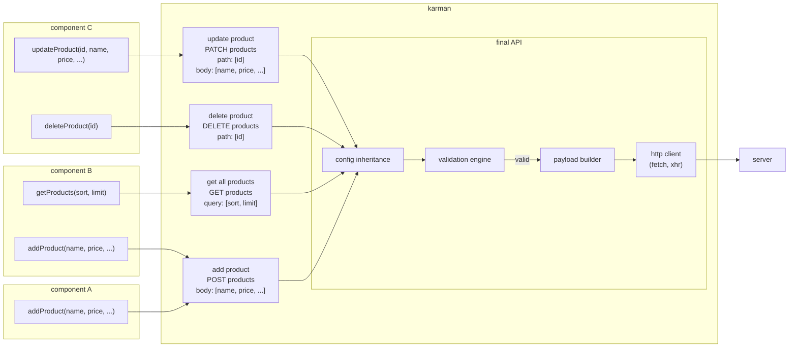
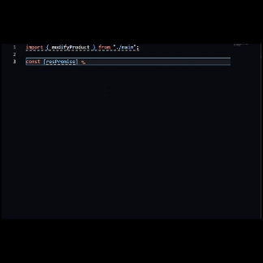

<div align="center">
    
</div>
<div align="center">
HTTP Client / API Centralized Management / API Abstraction Layer
</div>

<br>

- [繁體中文](./assets/doc/zh-tw/README.md)

## Table of Contents

- [Table of Contents](#table-of-contents)
  - [Core](#core)
- [Features](#features)
- [Getting Started](#getting-started)
  - [What is Karman?](#what-is-karman)
  - [Installation](#installation)
  - [Simple Demonstration](#simple-demonstration)
    - [Single Encapsulation](#single-encapsulation)
    - [Group Encapsulation](#group-encapsulation)
  
### Core

- [Karman Tree](./assets/doc/en/karman-tree.md)
- [Final API](./assets/doc/en/final-api.md)
- [Validation Engine](./assets/doc/en/validation-engine.md)
- [Middleware](./assets/doc/en/middleware.md)
- [Response Caching](./assets/doc/en/response-caching.md)
- [Dynamic Type Annotation](./assets/doc/en/dynamic-type-annotation.md)

## Features

- Consolidation of browser XMLHttpRequest and fetch request strategies
- Tree-like structure for route management
- Configuration inheritance and override
- Request and response interception
- Response caching mechanism
- Request cancellation methods
- Automatic JSON conversion for XMLHttpRequest and fetch I/O
- Dynamic type annotation
- Lifecycle of request methods
- Parameter validation engine
- Default parameter values
- :new: [String Rule - Array Syntax](./assets/doc/en/validation-engine.md)

## Getting Started

### What is Karman?

> [!NOTE]
> The term "Karman" originates from the boundary between Earth and outer space, known as the "Kármán line," symbolizing the abstract concept of the interface between frontend and backend.

Karman is a JavaScript package designed for building API abstraction layers. It employs a tree-like structure to manage API routes, methods on routes, and configurations. Additionally, Karman provides encapsulated APIs, ensuring uniform input/output interfaces for all APIs. Moreover, Karman supports DTO (Data Transfer Object) for configuring API input/output interfaces. By relying on data typing, the encapsulated APIs can display input/output interface types and localized annotations in hover tips when invoked. This allows developers using Karman to focus on the functionality provided by the APIs without worrying about complex request configurations. In essence, Karman makes the API abstraction layer resemble more of a "callable API documentation."

In previous scenarios, the following issues might arise when creating requests:

1. Complex configurations: Previous methods might require developers to manually handle various details, including routes, methods, and configurations. Such operations can lead to tedious and error-prone configuration processes, making the code difficult to maintain.

2. Inconsistency in data types: When handling input/output data, developers may encounter issues with inconsistent data types. This may require additional code for type conversion or validation, increasing code complexity and the risk of errors.

3. Lack of uniform input/output interfaces: Each API may have its own unique input/output format, requiring developers to spend extra time familiarizing themselves with each API's usage. This not only increases the learning curve but also limits code reusability.

4. API reusability: In previous methods, due to the lack of uniform input/output interfaces and a good abstraction layer, it's often challenging to achieve API reusability. Each time a new feature or service is developed, relevant request configurations need to be rewritten, reducing code reusability and increasing development workload.

In traditional request creation methods, request configurations are typically scattered across different components. These configurations may require additional operations depending on the API specifications or requirements, such as URL composition or parameter validation. When an API's specification is very complex or widely reused, it leads to a significant amount of redundant code in the project. Additionally, as shown in the diagram with "Add Product," different program flows may exist in different components.



On the other hand, Karman emphasizes the concept of "encapsulation before utilization." Through abstraction layers, Karman can conceal the intricate workings of APIs, including basic configurations, parameter validation, URL composition, and request body creation. This allows developers invoking APIs to focus solely on the functionality implemented by the APIs and the data transfer objects for input/output. This design approach of Karman helps simplify the development process, improve code readability and maintainability, and enhance API reusability.



### Installation

npm:

```bash
$ npm install @vic0627/karman
```

After installation, import the package using import:

```js
import { defineKarman, defineAPI } from "@vic0627/karman"
```

If you are using vite as your build tool, exclude this package from optimization:

```js
// vite.config.js
export default {
    optimizeDeps: {
        exclude: ['@vic0627/karman'],
    }
}
```

### Simple Demonstration

In Karman, API encapsulation is primarily achieved through two functions: `defineAPI` and `defineKarman`, each serving its own purpose:

- `defineAPI` is used to encapsulate a single API and can be used independently. It returns a new function.
- `defineKarman` is used to manage multiple APIs under multiple paths or common configurations. It needs to be used in conjunction with `defineAPI` and returns a tree-like structure (Karman Tree) object. All encapsulated APIs under various paths can be accessed through this object.

#### Single Encapsulation

Using `defineAPI`, you can encapsulate a single API and return a new function. Suppose we want to encapsulate the following API for retrieving product information:

```txt
GET https://karman.com/products
```

By default, the method of `defineAPI` is set to GET, and this API does not require any parameters. Therefore, we can simply provide the url to complete the configuration:

```js
import { defineAPI } from "@vic0627/karman"

export const getProducts = defineAPI({
    url: "https://karman.com/products"
})
```

Typically, API parameters fall into three categories:

- Path Parameters
- Query String Parameters
- Request Body

During configuration, you can use the key-value pairs in `payloadDef` to determine which parameters the returned function from `defineAPI` should accept, and the `payloadDef[key].position` will determine where the passed-in parameter will be used.

Let's encapsulate the following API for demonstration, which includes path parameters, query string parameters, and request body. Normally, a single API may not contain all types of parameters simultaneously, but for demonstration purposes, all parameter types are expressed here:

```txt
PATCH https://karman.com/products

Path Parameters:
- id: number         # An integer greater than or equal to 1

Query Parameters:
- name?: string      # String length less than 10

Body:
- price: number

Headers:
- Content-Type: application/json
```

Firstly, configure the method and URL for this API, and use `payloadDef` to configure the parameters required by the returned function. Use the `position` property to specify where each parameter should be used. When configuring path parameters, specify the actual position of the parameter in the URL using the format `:parameterName`, and if the parameter will only be used in the request body, the `position` property can be omitted:

```js
import { defineAPI } from "@vic0627/karman"

export const modifyProduct = defineAPI({
    method: "PATCH",
    url: "https://karman.com/products/:id",
    payloadDef: {
        id: {
            position: "path"    // Specify where the parameter will be used using the `position` property
        },
        name: {
            position: "query"
        },
        price: {
            // position: "body" // The parameter will be automatically included in the request body, so `position` can be omitted
        },
        // or
        price: null             // Directly assign null if there are no additional configurations (validation rules, default values, etc.)
    }
})
```

Next, encapsulate the validation rules and request headers according to the information in the document. Use the `required` or `rules` property to specify validation rules (for more detailed explanations, refer to the [Validation Engine](./assets/doc/en/validation-engine.md) section). Additionally, for some parameters, use the `defaultValue` property to assign default values:

```js
import { defineAPI } from "@vic0627/karman"

export const modifyProduct = defineAPI({
    method: "PATCH",
    url: "https://karman.com/products/:id",
    payloadDef: {
        id: {
            position: "path",
            required: true,                         // Specify as a required parameter
            rules: [                                // Define validation rules using an array to trigger the default intersection rules
                "int",                              // Specify the type as integer
                { min: 1 }                          // Minimum value is 1
            ]
        },
        name: {
            position: "query",
            rules: [
                "string",                           // Specify the type as string
                { max: 10, measurement: "length" }  // Maximum value is 10, measured by the length property
            ]
        },
        price: {
            rules: "number",
            required: true,
            defaultValue: () => 100                 // Default value is 100
        },
    },
    headers: {                                      // Provide header settings
        "Content-Type": "application/json; charset=utf-8"
    },
    validation: true                                // Enable validation engine
})
```

`defineAPI` takes the entire type of `payloadDef` as a generic parameter, allowing JSDoc to be added to the attributes of `payloadDef` to enforce type annotations for the attributes, facilitating correct type hints and auto-completion during API invocation:

```js
/**
 * Update partial product information
 */
export const modifyProduct = defineAPI({
    // ...
    payloadDef: {
        /**
         * Product ID
         * @description An integer greater than or equal to 1
         * @type {number}
         */
        id: {
            // ...
        },
        /**
         * Product name
         * @description String length less than 10
         * @type {string | void}        // Use void to indicate non-required
         */
        name: {
            // ...
        },
        /**
         * Product price
         * @default 100
         * @type {number}
         */
        price: {
            // ...
        },
    }
    // ...
})
```

Karman also provides the `dto` parameter for configuring the response specification, enabling the function to support a more complete return type. Here's a JSDoc example; for other type declaration examples, please refer to the [DTO of Response](./assets/doc/en/dynamic-type-annotation.md) section:

```js
/**
 * @typedef {object} ModifyProductRes
 * @prop {"success" | "error"} ModifyProductRes.status Status
 * @prop {string} ModifyProductRes.message Message
 */
// ...
export const modifyProduct = defineAPI({
    // ...
    /** @type {ModifyProductRes} */
    dto: null
})
```

By following the above steps to complete the encapsulation, you can obtain complete API information when invoking it:



#### Group Encapsulation

Group encapsulation allows you to manage APIs of the same series under the same structure. These APIs may share basic URL, request header configurations, etc. Suppose a project involves the following interconnected APIs:

```txt
POST   https://karman.com/auth/login            # User login
# Product management
GET    https://karman.com/products              # Retrieve all products
POST   https://karman.com/products              # Add a new product
PUT    https://karman.com/products/:id          # Update a single product
DELETE https://karman.com/products/:id          # Delete a single product
GET    https://karman.com/products/categories   # Retrieve all product categories
# Shopping cart management
GET    https://karman.com/carts                 # Retrieve all shopping carts
POST   https://karman.com/carts                 # Add a new shopping cart
PATCH  https://karman.com/carts/:id             # Edit a shopping cart
DELETE https://karman.com/carts/:id             # Delete a shopping cart
```

Next, use `defineKarman` to create the abstraction layer and set common configurations, but to save space, this example will omit the `payloadDef` for each API:

```js
// /karman/index.js
import { defineKarman, defineAPI } from "@vic0627/karman"

export default defineKarman({                               // Create an instance/node of Karman abstraction layer
    root: true,                                             // Specify this layer as the root node
    url: "https://karman.com",                              // Base URL for this node
    headers: {                                              // Configure common headers
        "Content-Type": "application/json; charset=utf-8",
    },
    onRequest(req) {                                        // Interceptor to define behavior before each request
        const token = localStorage["TOKEN"]
        if (this._typeCheck.isString(token))                // Use plugin to check token type
            req.headers["Access-Token"] = token
    },
    onResponse(res) {                                       // Interceptor to return the status code for successful requests
        return res.status === 200
    },
    api: {
        login: defineAPI({
            url: "auth/login",                              // No other related APIs, no need to create another node
            // ...
            onSuccess(res) {
                const { token } = res.data
                if (this._typeCheck.isString(token))
                    localStorage["TOKEN"] = token           // Write token to storage on successful request

                return !!token                              // Return whether login was successful
            }
        })
    },
    route: {
        product: defineKarman({
            url: "products",                                // Path segment extended based on the parent node
            api: {
                getAll: defineAPI(),
                addOne: defineAPI({
                    method: "POST",
                    // ...
                }),
                updateOne: defineAPI({
                    url: ":id",                             // Path segment extended based on this node
                    method: "PUT",
                    // ...
                }),
                delOne: defineAPI({
                    url: ":id",
                    method: "DELETE",
                    // ...
                }),
                getCategories: defineAPI({
                    url: "categories",
                    // ...
                })
            }
        }),
        cart: defineKarman({
            url: "carts",
            api: {
                getAll: defineAPI(),
                addNew: defineAPI({
                    method: "POST",
                    // ...
                }),
                modifyOne: defineAPI({
                    url: ":id",
                    method: "PATCH",
                    // ...
                }),
                delOne: defineAPI({
                    url: ":id",
                    method: "DELETE",
                    // ...
                })
            }
        })
    }
})
```

Once configured, `defineKarman()` will return a `Karman` instance (karman node) containing all methods within the `api` property. You can use this instance to call the encapsulated methods (final API). The final API itself is synchronous and initializes a request when called, returning a Promise for the response and a synchronous method to cancel the request. It's recommended to destructure them for easier access:

```js
// /path/to/your-file.js
import karman from "@/karman" // Path may vary depending on project's path alias configuration

// Retrieve all products
const [productsPromise] = karman.product.getAll()
// Use Promise chaining to retrieve response result
productsPromise.then((res) => {
    console.log(res)
})

// Member login
const [loginPromise] = karman.login({
    email: "karman@gmail.com",
    password: "karman_is_the_best",
})
newProductPromise.then((res) => {
    console.log(res)
});

// Async/await re-encapsulation for updating shopping cart method
const updateProduct = async () => {
    try {
        const [resPromise] = karman.cart.modifyOne({
            // ...
        })
        const res = await resPromise
        console.log(res)
    } catch (error) {
        console.error(error)
    }
};

// Async/await re-encapsulation for deleting product method
const deleteProduct = async ({ id }) => {
    try {
        // Besides the response Promise, here we retrieve the synchronous method to cancel the request
        const [delPromise, abortDelete] = karman.product.delOne({ id })
        // Cancel the delete product request if certain conditions are met
        if (someReason()) abortDelete()
        const res = await delPromise
        console.log(res)
    } catch (error) {
        // If the request is canceled, control will transfer to the catch block
        console.error(error)
    }
};
```