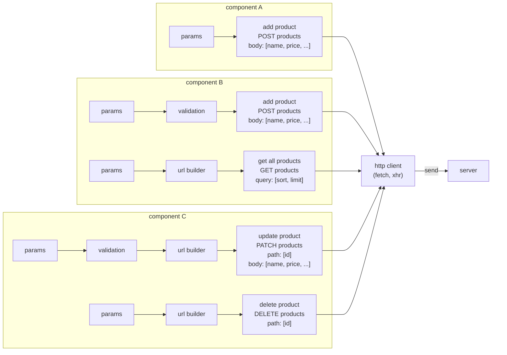
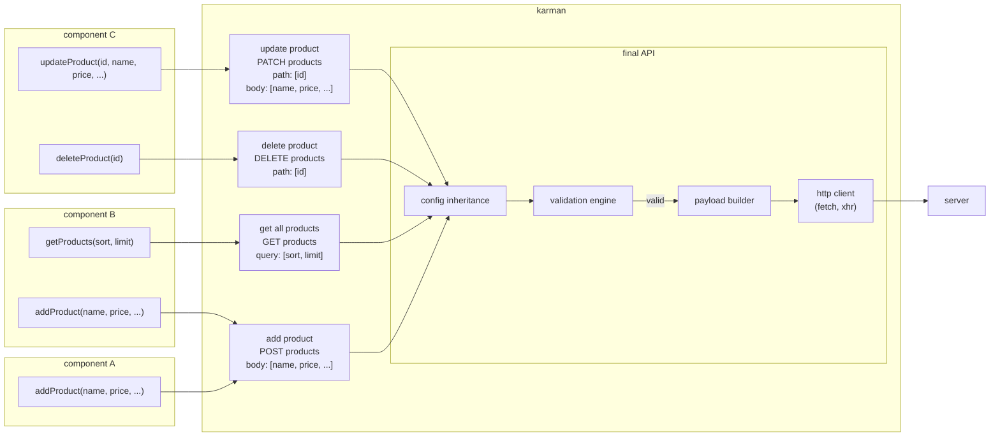

# Karman

HTTP 客戶端 / API 中心化管理 / API 抽象層

## 目錄

- [特色](#特色)
- [開始](#開始)
  - [什麼是 Karman？](#什麼是-karman)
  - [安裝](#安裝)
  - [簡易示範](#簡易示範)
- [核心](#核心)
  - [Karman Tree](#karman-tree)
  - [Final API](#final-api)
  - [Validation Engine](#validation-engine)
  - [Middleware](#middleware)
  - [Response Caching](#response-caching)
  - [Dynamic Type Annotation](#dynamic-type-annotation)
- [API 文件](#api-文件)
  - [defineKarman](#definekarman)
  - [defineAPI](#defineapi)
  - [defineCustomValidator](#definecustomvalidator)
  - [RuleSet](#ruleset)
  - [ValidationError](#validationerror)
  - [isValidationError](#isvalidationerror)

## 特色

- 彙整瀏覽器 XMLHttpRequest 與 fetch 請求策略
- 樹狀結構路由管理
- 配置的繼承與複寫
- 請求與響應的攔截
- 響應的快取機制
- 取消請求方法
- XMLHttpRequest、fetch 於 I/O 的 JSON 自動轉換
- 動態型別註解
- 請求方法的生命週期
- 參數驗證引擎
- :new: 參數預設值

## 開始

### 什麼是 Karman？

> [!NOTE]
> Karman 一詞源自於地球與外太空的分界線「卡門線 Kármán line」，用以比喻前後端交界處的抽象概念。

Karman 是一個 JavaScript 套件，專為建構 API [抽象層](https://en.wikipedia.org/wiki/Abstraction_layer)而設計。它採用樹狀結構來管理 API 的路由、路由上的方法以及配置等內容。同時，Karman 提供了封裝後的 API，使得所有 API 都具有統一的輸入/輸出介面。此外，Karman 支援配置 API 輸入/輸出介面的 DTO（Data Transfer Object）。透過對數據類型的依賴，封裝後的 API 在被調用時能夠在懸停提示中顯示出輸入/輸出介面的類型以及區域註解。這使得使用 Karman 調用 API 的開發人員可以專注於 API 所提供的功能，而無需煩惱複雜的請求配置。簡而言之，Karman 讓 API 抽象層變得更像是「可發送請求的 API 文件」。

在以往的情況下，建立請求時可能會發生以下問題：

1. 複雜的配置：以往的方法可能需要開發人員手動處理各種細節，包括路由、方法和配置等。這樣的操作可能會導致配置過程繁瑣且容易出錯，並且使得代碼難以維護。

2. 資料型別的不一致性：在處理輸入/輸出數據時，開發人員可能會面臨資料型別不一致的問題。這可能需要額外的代碼來處理型別轉換或驗證，增加了代碼的複雜性，同時也增加了錯誤發生的風險。

3. 缺乏統一的輸入/輸出介面：每個 API 可能有自己獨特的輸入/輸出格式，這使得開發人員需要花費額外的時間來熟悉每個 API 的使用方式。這不僅增加了學習成本，也限制了代碼的復用性。

4. API 復用性：在以往的方法中，由於缺乏統一的輸入/輸出介面和良好的抽象層，往往難以實現 API 的復用。每次開發新功能或服務時，都需要重新編寫相關的請求配置，這降低了代碼的復用性，增加了開發工作量。

在傳統的請求建立方式中，請求的配置通常是分散在不同的組件中。這些配置根據 API 的規格或需求的不同，可能還需要額外的操作，例如 URL 的組成或參數的驗證等。當一個 API 的規格非常複雜或者被廣泛復用時，就會導致專案中出現大量重複的程式碼。此外，就像在圖中展示的 `Add Product` 一樣，可能在不同的組件中存在著不同的程式流程。



另一方面，Karman 強調了「先封裝、再使用」的理念。透過抽象層，Karman 可以隱藏 API 的繁複工作內容，包括基本配置、參數驗證、URL 組成和請求體建立等。這使得調用 API 的開發人員僅需專注於 API 所實現的功能，以及輸入/輸出的資料傳輸物件。Karman的這種設計方式有助於簡化開發流程，提高代碼的可讀性和可維護性，同時增強了 API 的復用性。



### 安裝

npm：

```bash
$ npm install @vic0627/karman
```

安裝後，使用 `import` 導入套件：

```js
import { defineKarman, defineAPI } from "@vic0627/karman"
```

如果你是使用 `vite` 作為建構工具，請將此套件排除在最佳化之外：

```js
// vite.config.js
export default {
    optimizeDeps: {
        exclude: ['@vic0627/karman'],
    }
}
```

### 簡易示範

在 Karman 中，主要由兩支函式來進行 API 的封裝，分別為 `defineAPI` 與 `defineKarman`，兩支函式各司其職：

- `defineAPI` 主要對單一支 API 進行封裝，可單獨使用，會返回一支新的函式。
- `defineKarman` 主要為管理多個路徑或共同配置下的多支 API，需搭配 `defineAPI` 使用，會返回一個樹狀結構（Karman Tree）的物件，可以通過此物件訪問所有路徑下封裝過的 API。

#### 單一封裝

使用 `defineAPI` 可以對單一支 API 進行封裝，並返回一個新的函式，假設要封裝以下這支取得商品資訊的 API：

```txt
GET https://karman.com/products
```

`defineAPI` 的 `method` 預設為 GET，且此 API 無須任何參數，因此可以只帶入 `url` 即可完成配置：

```js
import { defineAPI } from "@vic0627/karman"

export const getProducts = defineAPI({
    url: "https://karman.com/products"
})
```

通常情況下，API 的參數將分為三種類型：

- 路徑參數（Path Parameter）
- 查詢參數（Query String Parameter）
- 請求主體（Request Body）

配置時，可以透過 `payloadDef` 的鍵值來決定 `defineAPI` 所返回的函式該接收哪些參數，而 `payloadDef[key].position` 將決定傳入的參數將用在哪裡。

以下面這支 API 進行封裝示範，這支 API 同時包含了路徑參數、查詢參數與請求主體，通常情況下，單一支 API 可能不會同時包含所有的參數類型，但此例為方便示範所以將各種參數類型都表述出來：

```txt
PATCH https://karman.com/products

Path Parameters:
- id: number         # 大於等於 1 的整數

Query Parameters:
- name?: string      # 字串長度小於 10

Body:
- price: number

Headers:
- Content-Type: application/json
```

首先，先配置此 API 的方法及 url，並以 `payloadDef` 配置返還的函式所需參數，後用 `position` 屬性指定該參數的使用方式。配置路經參數時，需要以 `:參數名` 的格式在 url 中指定參數實際的位置，而若參數只會用於請求體，則可省略 `position` 屬性：

```js
import { defineAPI } from "@vic0627/karman"

export const modifyProduct = defineAPI({
    method: "PATCH",
    url: "https://karman.com/products/:id",
    payloadDef: {
        id: {
            position: "path"    // 用 `position` 屬性來指定參數用於哪裡
        },
        name: {
            position: "query"
        },
        price: {
            // position: "body" // 參數預設會帶入請求主體，可省略
        },
        // or
        price: null             // 若無其他配置（驗證規則、預設值等）可直接給 null
    }
})
```

接著，依照文件上的資訊依序封裝驗證規則、請求頭，這邊將使用 `required` 或 `rules` 屬性指定驗證規則（其他更詳細的介紹請參考[驗證引擎](#validation-engine)），並在部分參數使用 `defaultValue` 屬性給予參數預設值：

```js
import { defineAPI } from "@vic0627/karman"

export const modifyProduct = defineAPI({
    method: "PATCH",
    url: "https://karman.com/products/:id",
    payloadDef: {
        id: {
            position: "path",
            required: true,                         // 指定為必填參數
            rules: [                                // 定義驗證規則，使用陣列觸發預設的交集規則
                "int",                              // 指定型別為整數類型
                { min: 1 }                          // 最小值 1
            ]
        },
        name: {
            position: "query",
            rules: [
                "string",                           // 指定型別為字串類型
                { max: 10, measurement: "length" }  // 最大值 10，測量 length 屬性
            ]
        },
        price: {
            rules: "number",
            required: true,
            defaultValue: () => 100                 // 預設值 100 
        },
    },
    headers: {                                      // 帶入 headers 設定
        "Content-Type": "application/json; charset=utf-8"
    },
    validation: true                                // 啟用驗證引擎
})
```

`defineAPI` 會將整個 `payloadDef` 的類型作為泛型參數，因此可以對 `payloadDef` 的屬性加上 JSDoc 來強制註記屬性的型別，方便後續調用 API 時於懸停提示及自動完成顯示正確型別：

```js
/**
 * 更新部分商品資訊
 */
export const modifyProduct = defineAPI({
    // ...
    payloadDef: {
        /**
         * 商品 id
         * @description 大於等於 1 的整數
         * @type {number}
         */
        id: {
            // ...
        },
        /**
         * 商品名稱
         * @description 字串長度小於 10
         * @type {string | void}        // 以 void 表示非必填
         */
        name: {
            // ...
        },
        /**
         * 商品價格
         * @default 100
         * @type {number}
         */
        price: {
            // ...
        },
    }
    // ...
})
```

Karman 另外有提供配置響應規格的參數 `dto`，可使該函式支援更完整的返回類型，這邊以 JSDoc 示範，其他聲明型別的範例請參考 [DTO of Response](#dto-of-outputresponse) 章節：

```js
/**
 * @typedef {object} ModifyProductRes
 * @prop {"success" | "error"} ModifyProductRes.status 狀態
 * @prop {string} ModifyProductRes.message 訊息
 */
// ...
export const modifyProduct = defineAPI({
    // ...
    /** @type {ModifyProductRes} */
    dto: null
})
```

按上述步驟進行完整的封裝，即可在調用時獲取完整的 API 訊息：


#### 群組封裝

群組封裝可以將同系列的 API 管理在同一層結構下，這些 API 之間可能會共享基本 url、請求頭配置等，假設某專案有串接的 API 如下：

```txt
POST   https://karman.com/auth/login            # 用戶登入
# 商品管理
GET    https://karman.com/products              # 取得所有商品
POST   https://karman.com/products              # 新增商品
PUT    https://karman.com/products/:id          # 更新單一商品
DELETE https://karman.com/products/:id          # 刪除單一商品
GET    https://karman.com/products/categories   # 取得所有商品種類
# 購物車管理
GET    https://karman.com/carts                 # 取得所有購物車
POST   https://karman.com/carts                 # 新增購物車
PATCH  https://karman.com/carts/:id             # 編輯購物車
DELETE https://karman.com/carts/:id             # 刪除購物車
```

接著使用 `defineKarman` 建立抽象層及寫入共同設定等，但為節省篇幅，此範例將省略各 API 的 `payloadDef`：

```js
// /karman/index.js
import { defineKarman, defineAPI } from "@vic0627/karman"

export default defineKarman({                               // 創建 Karman 抽象層實例/節點
    root: true,                                             // 指定此層為根節點
    url: "https://karman.com",                              // 此節點的基本 url
    headers: {                                              // 配置共同 headers
        "Content-Type": "application/json; charset=utf-8",
    },
    onRequest(req) {                                        // 攔截器定義每次請求前行為
        const token = localStorage["TOKEN"]
        if (this._typeCheck.isString(token))                // 使用插件檢查 token 型別
            req.headers["Access-Token"] = token
    },
    onResponse(res) {                                       // 攔截器返回請求成功的狀態碼
        return res.status === 200
    },
    api: {
        login: defineAPI({
            url: "auth/login",                              // 無其他相關 API，不另建節點
            // ...
            onSuccess(res) {
                const { token } = res.data
                if (this._typeCheck.isString(token))
                    localStorage["TOKEN"] = token           // 請求成功，將 token 寫入 storage

                return !!token                              // 返回登入成功與否
            }
        })
    },
    route: {
        product: defineKarman({
            url: "products",                                // 根據上一層節點延伸的路徑片段
            api: {
                getAll: defineAPI(),
                addOne: defineAPI({
                    method: "POST",
                    // ...
                }),
                updateOne: defineAPI({
                    url: ":id",                             // 根據此節點延伸的路徑片段
                    method: "PUT",
                    // ...
                }),
                delOne: defineAPI({
                    url: ":id",
                    method: "DELETE",
                    // ...
                }),
                getCategories: defineAPI({
                    url: "categories",
                    // ...
                })
            }
        }),
        cart: defineKarman({
            url: "carts",
            api: {
                getAll: defineAPI(),
                addNew: defineAPI({
                    method: "POST",
                    // ...
                }),
                modifyOne: defineAPI({
                    url: ":id",
                    method: "PATCH",
                    // ...
                }),
                delOne: defineAPI({
                    url: ":id",
                    method: "DELETE",
                    // ...
                })
            }
        })
    }
})
```

配置完成後，`defineKarman()` 會返回包含 `api` 屬性內所有方法的 `Karman` 實例（karman node），可以透過該實例去調用封裝好的方法（final API），而 final API 本身是同步的，調用時會初始化請求並返回一個響應 Promise 與一個取消請求的同步方法，建議可以透過[解構賦值](https://developer.mozilla.org/en-US/docs/Web/JavaScript/Reference/Operators/Destructuring_assignment)的方式將它們取出：

```js
// /path/to/your-file.js
import karman from "@/karman" // 根據專案的 path alias 的設定，路徑可能有所不同

// 取得所有商品
const [productsPromise] = karman.product.getAll()
// 使用 Promise chaining 取得響應結果
productsPromise.then((res) => {
    console.log(res)
})

// 會員登入
const [loginPromise] = karman.login({
    email: "karman@gmail.com",
    password: "karman_is_the_best",
})
newProductPromise.then((res) => {
    console.log(res)
});

// async/await 二次封裝更新購物車方法
const updateProduct = async ({ id, title }) => {
    try {
        const [resPromise] = karman.cart.modifyOne({
            // ...
        })
        const res = await resPromise
        console.log(res)
    } catch (error) {
        console.error(error)
    }
};

// async/await 二次封裝刪除商品方法
const deleteProduct = async ({ id }) => {
    try {
        // 除了響應 Promise 外，這邊取出了許消請求的方法
        const [delPromise, abortDelete] = karman.product.delOne({ id })
        // 滿足條件時，取消刪除商品請求
        if (someReason()) abortDelete()
        const res = await delPromise
        console.log(res)
    } catch (error) {
        // 若請求被取消，程式控制權將轉移至 catch block
        console.error(error)
    }
};
```

## 核心

### Karman Tree

在[簡易示範](#簡易示範)中有提到，可以透過 `defineKarman()` 來建立一個抽象層節點、一個 Karman 實例、或稱「karman node」，事實上你還可以透過巢狀的方式去組織更複雜的「karman tree」，這使得我們可以根據 API 的路徑、所需配置不同，去做不同層次的管理。

#### URL Management

每個 `defineKarman()` 內都可以配置屬於該層的 url 路徑，路徑可以配置或不配置，可以是完整的 url 也可以是 url 的片段，但要注意，你為 karman node 所配置的 url 會參考父節點的 url 組合成一組該節點的基本 url。

```js
import { defineKarman } from "@vic0627/karman"

const rootKarman = defineKarman({
    root: true,
    // 此節點的 baseURL 是 "https://karman.com"
    url: "https://karman.com",
    route: {
        product: defineKarman({
            // 此節點的 baseURL 是 "https://karman.com/products"
            url: "products"
        }),
        user: defineKarman({
            // 此節點的 baseURL 是 "https://karman.com/users"
            url: "users"
        })
    }
})
```

若是要配置子節點，可以透過 `route` 屬性進行配置，`route` 會是一個物件，key 是該節點的名稱，value 是 karman node，而 karman node 會在初始化後被掛載至父節點上，可以通過你為該子節點所配置的路徑名稱存取該 karman node 上的 final API 或孫節點。

```js
rootKarman.product.someAPI()
rootKarman.user.someNode.someAPI()
```

另外，在不多見的情況下，前端可能會使用到不同網域下的 API，也可以透過 `defineKarman()` 進行整合，讓整份專案都通過單一窗口去和不同伺服器進行溝通。

```js
import { defineKarman } from "@vic0627/karman"

export default defineKarman({
    // 這層 url 為空
    root: true,
    route: {
        source01: defineKarman({
            // 這層管理 source01 底下的所有 API
            url: "https://source01.com"
        }),
        source02: defineKarman({
            // 這層管理 source02 底下的所有 API
            url: "https://source02.com"
        }),
    }
})
```

#### Inheritance

「繼承事件」會發生在當該層 karman node 的 `root` 被設置為 `true` 時觸發，事件被觸發時，會將根節點的配置繼承至子節點甚至孫節點上，直到該配置被子孫節點複寫，而複寫後的配置也會有相同的繼承行為。

```js
import { defineKarman } from "@vic0627/karman"

export default defineKarman({
    // ...
    root: true,
    // 配置 headers 以供繼承
    headers: {
        "Content-Type": "application/json; charset=utf-8",
    },
    route: {
        route01: defineKarman({
            // 此節點會繼承上一層節點的 headers 配置
        }),
        route02: defineKarman({
            // 此節點複寫了 headers
            headers: {
                // ...
            }
        }),
    }
})
```

> [!CAUTION]
> `headers` 請配置靜態的屬性，若要將動態資訊寫入 `headers`，請利用[攔截器](#middleware)。

karman tree 若是沒有配置根節點，會有以下的注意事項：

- 雖然 API 同樣可以發送，但該 API 所獲取的配置只會以該層 karman node 為參考，若是該節點的 `url` 與 API 配置的 `url` 無法組成有效的 url，這可能會導致發送請求時出現錯誤。
- 無法使用根節點的專屬功能，如：設置排程任務執行間隔、為 karman tree 安裝依賴等。

> [!NOTE]
> 排程管理器主要任務負責響應資料快取的檢查與清除，任務執行間隔可以透過 `scheduleInterval` 屬性進行設置，且只能透過根節點設置。

每個 karman node 的繼承事件只會被觸發一次，意味著若某子孫節點被設置為根節點，該 karman node 就會先產生一次的繼承事件，當這個 karman node 後續再接收到祖父節點傳遞下來的繼承訊號時，會因為該節點已經發生過繼承事件，使該節點以下（含）的所有節點中斷繼承。

#### Dependency

在 [Middleware](#middleware) 中會介紹到 Interceptors 與 Hooks 的配置，這類型的配置都可以在函式內透過 `this` 來獲取 karman node 上的屬性或方法，假設有在 Middleware 中常用的常數、方法等，可以考慮將其安裝到 karman node 上。

依賴的安裝需要透過 root karman node 來執行，使用 `Karman.$use()` 的方法進行安裝，安裝後會再觸發一次類似的繼承事件，使整個 karman tree 都會引用到該依賴，而依賴本身必須為物件，並且物件上需有 `install()` 方法。

除此之外，Karman 本身也有提供內建的依賴可以使用：

- `Karman._typeCheck`：[驗證引擎](#validation-enigine) String Rule 所使用的型別驗證器。
- `Karman._pathResolver`：karman 在進行 url 組成時所使用的模組，類似於 node.js 的 `path` 模組。

```js
import { defineKarman } from "@vic0627/karman"

// hooks 中的常用方法
const add = (a, b) => a + b
// 先為 add 定義 install 方法
Object.defineProperty(add, "install", {
    value: (karman) => {
        // 接著定義 install 方法的實現
        Object.defineProperty(karman, "_add", {
            { value: add }
        })
    }
})

const karman = defineKarman({
    root: true,
    onRequest() {
        const isString = this._typeCheck.isString("")           // 內建依賴
        const paths = this._pathResolver.trim("//foo/bar///")   // 內建依賴
        const sum = this._add(2, 3)                             // 自行安裝的依賴
        console.log(isString, paths, sum)
    }
    // ...
})

karman.$use(_add) // 使用 root karman node 安裝依賴

karman.someAPI() // console output: true "foo/bar" 5
```

**補充：讓依賴支援語法提示**

若想要讓安裝的依賴也能夠支援語法提示功能，可以使用 `.d.ts` 聲明文件，首先將依賴寫在另一份 `.js` 中：

```js
// /src/karman/constant.js
const _constant = {
    second: 1000,
    minute: 1000 * 60,
    hour: 1000 * 60 * 60,
    install(karman) {
        Object.defineProperty(karman, '_constant', { value: this })
    }
}
export default _constant
```

在同一個目錄下，新增一份名稱相同的 `.d.ts` 聲明文件：

```ts
// /src/karman/constant.d.ts
interface Constant {
    second: number;
    minute: number;
    hour: number;
}
declare const _constant: Constant
export default _constant

// ⚠️ 模組擴展的聲明一定要記得撰寫，將依賴聲明在 KarmanDependencies 之中
declare module "@vic0627/karman" {
    interface KarmanDependencies {
        /**
         * 也可以用 block comment 為依賴撰寫註解文件
         */
        _constant: Constant;
    }
}
```

最後，在 root karman 的文件中引入依賴，後續在 Middleware 中使用依賴時，就能支援完整的語法提示：

```js
// /src/karman/index.js
import { defineKarman } from "@vic0627/karman"
import constant from "./constant"

const rootKarman = defineKarman({
    // ...
    onRequest() {
        this._constant // <= hover 顯示型別、註解
    }
})

rootKarman.$use(constant)
```

### Final API

「final API」是透過 `defineAPI()` 設置於 karman node 的 `api` 內的方法，且與 karman tree 同樣會有繼承與複寫的行為，final API 會在初始化時先記錄由 `defineAPI()` 給予的配置，並在運行時引用所屬 karman node 的配置後再以初始化時紀錄的配置進行複寫。

final API 同樣可以選擇配置 url 或 url 的片段，當今天某路由上可能只有零星幾個 API 時，可以考慮將他們配置到父節點上，而不用另外在建立新的節點，讓路由的配置可以更彈性。

```js
import { defineKarman, defineAPI } from "@vic0627/karman"

export default defineKarman({
    root: true,
    url: "https://karman.com/products",
    api: {
        getAll: defineAPI(),
        // 此 final API 的 url 是 "https://karman.com/products/categories"
        getCategories: defineAPI({
            url: "categories"
        })
    }
})
```

#### Syntax

在調用 final API 時，與一般 HTTP Client 不同，final API 本身是同步任務，會先進行如：參數驗證、參數構建、初始化請求所需資料與配置等任務，並返回用戶端一個等待響應結果的 Promise 與一個取消請求方法，用戶端需要另外等待該 Promise fulfilled 之後，才會拿到該次響應結果。

```js
const [resPromise, abort] = karman.finalAPI(payload[, config])
```

- `resPromise`：響應結果，本身為一個 Promise 物件，可用 async/await 或 Promise chain 來獲取資料。
- `abort`：取消請求方法，是同步任務。
- `payload`：final API 主要接收的參數物件，為定義 final API 時透過 payloadDef 來決定此物件須具備甚麼屬性參數，倘若 payloadDef 並未定義所需參數，調用 final API 時又有設定 config 的需求時，payload 可傳入空物件、undefined、null 等值。
- `config`：最後複寫 API 配置的參數，但無法複寫如：url、method、payloadDef 等初始配置。

#### Inheritance

final API 的配置繼承與複寫分為幾個階段：

- defineAPI 配置：此階段會先暫存接收到的配置，提供後續的繼承與複寫。
- runtime 配置：final API 被呼叫時會提供最後複寫配置的機會，若有接收到配置，會先進行暫存動作。
- 第一階段繼承：此階段會先比較 runtime 配置與暫存的 runtime 配置，若前後兩次的配置相同，會略過此階段的繼承行為，否則以 runtime 配置複寫 defineAPI 的配置。
- 第二階段繼承：此階段會引用 final API 所屬 karman node 的配置，並以第一階段繼承後的配置進行複寫，進而獲得 final API 的最終配置。

#### Request Strategy

`requestStrategy` 屬性可以決定該 final API 所選用的 HTTP Client，目前支援 `"xhr"` 與 `"fetch"` 作為參數，並以 `"xhr"` 為預設選項。

```js
import { defineKarman, defineAPI } from "@vic0627/karman"

export default defineKarman({
    root: true,
    url: "https://karman.com/products",
    api: {
        // 此方法將使用預設的 XMLHttpRequest 作為 HTTP Client
        getAll: defineAPI(),
        // 此方使用 fetch 作為 HTTP Client
        getCategories: defineAPI({
            url: "categories",
            requestStrategy: "fetch",
        })
    }
})
```

> [!WARNING]
> 不同的請求策略有不同的響應格式，在處理響應的資料上需要注意。

#### Parameter Definition

在定義該方法所需的參數時可以透過 `payloadDef` 屬性，key 是參數名稱，value 是該參數的相關定義，相關定義包括：該參數要用在哪裡、是否為必要參數、[參數的驗證規則](#validation-enigine)。

首先決定該參數要用在哪裡，可以透過 `position` 屬性來決定，以下是可接受值：

- `"path"`：指定為路經參數，需在 `url` 屬性中以 `:參數名` 的格式定義參數的確切位置。
- `"query"`：會以 `參數名=參數值` 的格式串接 url 的查詢參數。
- `"body"`：會將參數用於請求體中，與 `query` 相同的是，key 都會採用 `payloadDef` 中所定義的名稱。

以上類型可以用 `string[]` 賦予 `position`，代表同一參數可以用在請求中的不同地方，例如 `position: ["path", "body"]` 代表此參數同時用於路徑參數與請求體中。

接下來決定參數是否必須，可以透過 `required: boolean` 來設置，但要注意的是，驗證參數是否為必須的行為，屬於驗證引擎的一環，但因設計上的考量沒有將 `required` 放在 `rules` 內，因此必須在該 final API 上的某個父節點或 API 配置本身將 `validation` 設置為 `true` 來啟動驗證機制。

> [!WARNING]
> required 驗證會以 `in` 運算子來檢驗該參數的 key 是否存在於 `payload` 當中，並不代表該參數以 `undefined` 作為容許值。

最後在[參數驗證規則](#validation-enigine)的部分較為複雜，因此以獨立章節來解說。

```js
import { defineKarman, defineAPI } from "@vic0627/karman"

const karmanProduct = defineKarman({
    root: true,
    url: "https://karman.com/products",
    validation: true,                   // 先啟動該節點的驗證引擎
    api: {
        getAll: defineAPI({
            payloadDef: {
                limit: {
                    position: "query"   // 非必要參數 limit 將用在查詢參數
                }
            }
        }),
        getById: defineAPI({
            url: ":id/:category",
            payloadDef: {
                id: {                   
                    required: true,
                    position: "path"    // 必要參數 id 將用於 url 中的變數
                },
                category: {             // 非必要參數 category 將用於路徑中的變數與查詢參數
                    position: ["path", "query"]
                }
            }
        })
    }
})

karmanProduct.getALL()                  // url: https://karman.com/products
karmanProduct.getALL({ limit: 10 })     // url: https://karman.com/products?limit=10
karmanProduct.getById()                 // ValidationError
karmanProduct.getById({ id: 10 })       // url: https://karman.com/products/10
karmanProduct.getById({                 // url: https://karman.com/products/10/clothes
    id: 10,
    category: "clothes"
})
```

在參數預設值的部分，可以通過 `defaultValue` 屬性來設定，該屬性必須為一個方法，而方法的返回值將作為該參數的預設值使用。

另外，假設有設定驗證規則，預設值也會經過驗證引擎的驗證，所以你無法賦予不符合驗證規則的預設值給該參數，確保參數的正確性。

```js
const setDefault = defineAPI({
    // ...
    validation: true,
    payloadDef: {
        param01: {
            rules: "char",
            // defaultValue: () => "Hi", // => ValidationError
            defaultValue: () => "K"
        }
    }
})
```

**補充：復用參數定義**

通常情況下，多組 API 可能會使用到重複的參數，這時可以考慮將參數的定義抽離出來，以工廠的方式將其封裝，提供可選及參數位置的傳入，使參數可以在相同驗證規則的情況下，做到更大彈性的配置。

此外，利用 JSDoc 完善型別註記與註解，可使工廠產出的定義物件更型別友善。

```js
// /payload-def/id.js
/**
 * 編號定義工廠
 * @param {R} required - 是否必要
 * @param {import('@vic0627/karman').ParamPosition[]} [position] - 參數位置
 * @template {boolean} R
 */
export default (required, position = ["body"]) => ({
  /**
   * 編號
   * @min 1
   * @type {R extends true ? number : (number | void)}
   */
  id: {
    required,
    position,
    rules: ["int", { min: 1 }],
  },
});
```

### Validation Engine

驗證引擎包辦了 final API 的參數驗證機制，在 final API 發送請求時，會驗證接收參數是否符合參數定義的驗證規則，若是有參數未通過驗證，該次請求將不會建立，並拋出 `ValidationError`，其中錯誤訊息能由驗證引擎自動產生或由使用者自行定義。

#### Rules

驗證規則有很多種，從驗證引擎本身所提供的到客製化驗證函式，會有以下這些種類：

- **String Rule**

    由字串所描述的型別，為 JavaScript 原始型別的擴展，在某些特殊型別會有其獨有的定義，此規則會由驗證引擎自動產生錯誤訊息。

    - `"char"`：字符，長度為 1 的字串
    - `"string"`：字串
    - `"int"`：整數
    - `"number"`：數字
    - `"nan"`：NaN
    - `"boolean"`：布林值
    - `"object"`：廣義物件，包含 `null`、`() => {}`、`{}`、或`[]`
    - `"null"`：null
    - `"function"`：函式
    - `"array"`：陣列
    - `"object-literal"`：以花括號所表示的物件
    - `"undefined"`：undefined
    - `"bigint"`：bigint
    - `"symbol"`：symbol

- **Constructor**

    任何建構函式（class），驗證引擎會以 `instanceof` 進行驗證。

- **Custom Validator**

    客製化驗證函式，但理論上 JavaScript 無法辨識普通函式與建構函式的差異，因此需要透過 `defineCustomValidator()` 來進行定義，否則會將該函式視為建構函式來處理。

- **Regular Expression**

    正則表達式，可以包含或不包含錯誤訊息。

- **Parameter Descriptor**

    參數描述符，以物件形式構成，可以定義參數的最大、最小、相等值、以及測量屬性，使用上最好與 String Rule 搭配，形成一個 [Rule Set](#rule-set)，先進行型別的驗證後再進行單位的測量，確保驗證機制的完整性。

```js
import { defineKarman, defineAPI, defineCustomValidator, ValidationError } from "@vic0627/karman"

const customValidator = defineCustomValidator((prop, value) => {
    if (value !== "@vic0627/karman")
        throw new ValidationError(`參數 '${prop}' 必為 'karman' 但卻接收到 '${value}'`)
})

const emailRule = { 
    regexp: /^[^\s@]+@[^\s@]+\.[^\s@]+$/,
    errorMessage: "錯誤的 email 格式"
}

const karman = defineKarman({
    // ...
    validation: true,
    api: {
        ruleTest: defineAPI({
            payloadDef: {
                param01: { rules: "char" },             // String Rule
                param02: { rules: Date },               // Constructor
                param03: { rules: customValidator },    // Custom Validator
                param04: { rules: emailRule },          // Regular Expression
                param05: {                              // Parameter Descriptor
                    rules: {
                        min: 0,
                        max: 5,
                        measurement: "length"
                    }
                },
            }
        }),
    }
})

karman.ruleTest()                                       // 沒有參數設置 required，因此不會拋出錯誤
karman.ruleTest({ param01: "A" })                       // Valid
karman.ruleTest({ param01: "foo" })                     // ValidationError
karman.ruleTest({ param02: new Date() })                // Valid
karman.ruleTest({ param02: "2024-01-01" })              // ValidationError
karman.ruleTest({ param03: "@vic0627/karman" })         // Valid
karman.ruleTest({ param03: "bar" })                     // ValidationError: 參數 'param03' 必為 'karman' 但卻接收到 'bar'
karman.ruleTest({ param04: "karman@gmail.com" })        // Valid
karman.ruleTest({ param04: "karman is the best" })      // ValidationError: 錯誤的 email 格式
karman.ruleTest({ param05: "@vic0627/karman" })         // Valid
karman.ruleTest({ param05: "karman is the best" })      // ValidationError
karman.ruleTest({ param05: 1 })                         // 會以警告提示找不到可測量的屬性
```

#### Rule Set

規則的集合，為上一章節所說明的規則所排列構成，會由集合索引首位的規則開始依序驗證，而種類有交集規則（Intersection Rules）與聯集規則（Union Rules），分別會觸發不同的驗證機制。

- **Intersection Rules**

    可以透過 `defineIntersectionRules()` 或普通陣列來定義，驗證引擎在接收到普通陣列作為規則時，會將其隱式轉換成聯集規則，當使用此集合作為驗證規則時，參數須符合所有規則才算通過驗證。

- **Union Rules**

    透過 `defineUnionRules()` 定義，使用此集合作為驗證規則時，參數只須符合集合中的其中一項規則即代表通過驗證。

```js
import { defineKarman, defineAPI, defineIntersectionRules, defineUnionRules } from "@vic0627/karman"

const karman = defineKarman({
    // ...
    api: {
        ruleSetTest: defineAPI({
            param01: {
                // 陣列將隱式轉換成聯集規則
                rules: [
                    "string",
                    {
                        min: 1,
                        measurement: "length"
                    }
                ]
            },
            param02: {
                // 與 param01 的規則等效
                rules: defineIntersection(
                    "string",
                    {
                        min: 1,
                        measurement: "length"
                    }
                )
            },
            param03: {
                // 交集規則
                rules: defineUnionRules(
                    "string",
                    "number",
                    "boolean"
                )
            }
        })
    }
})

karman.ruleSetTest({ param01: "" })     // ValidationError
karman.ruleSetTest({ param02: "foo" })  // Valid
karman.ruleSetTest({ param03: false })  // Valid
```

### Middleware

Middleware 是指在 final API 執行時的某個生命週期中執行的函式，主要分為兩類：

- **Interceptors**：於 karman node 上配置，主要攔截該節點以下的所有 final API 的請求（req）與響應（res）物件，可以實現存取物件屬性並有條件地執行副作用等功能，只能以同步任務定義。
- **Hooks**：於定義 API 或調用 final API 時配置，被定義的 hooks 只適用於該 final API，某些 hooks 可以以非同步任務定義，或具備返回值，可透過返回值來改變某些行為或參數。

```js
import { defineKarman, defineAPI } from "@vic0627/karman"

const hooksKarman = defineKarman({
    // ...
    validation: true,
    // Interceptors
    /**
     * 攔截請求物件，包括請求的 url、method、headers 等其他請求配置
     * @param req - 請求物件
     */
    onRequest(req) {
        console.log("onRequest")
        req.headers["Access-Token"] = localStorage["TOKEN"]
    },
    /**
     * 攔截響應物件，依照每個 final API 選用的請求策略不同，可能會有不同規格，在物件屬性的存取上需稍加注意
     * @param res - 響應物件
     * @returns {boolean | undefined} 可自行判斷合法狀態碼，並返回布林值，預設是大於等於 200、小於 300 的區間
     */
    onResponse(res) {
        console.log("onResponse")
        const { status } = res

        return status >= 200 && status < 300
    },
    api: {
        hookTest: defineAPI({
            // ...
            // Hooks
            /**
             * 於驗證前調用，但若 `validation === false` 則會被忽略
             * 通常可以用來動態改變驗證規則、給予參數預設值、手動對較複雜的參數類型進行驗證等
             * @param payloadDef - 參數定義物件
             * @param payload - final API 實際接收參數
             */
            onBeforeValidate(payloadDef, payload) {
                console.log("onBeforeValidate")
            },
            /**
             * 會在建構最終的請求 url 及請求體前執行，可以用來給予參數預設值或對 payload 物件進行其他資料處理的動作
             * @param payload - final API 實際接收參數
             * @returns {Record<string, any> | undefined} 若返回值為物件，將做為新的 payload 來建構 url 與請求體
             */
            onRebuildPayload(payload) {
                console.log("onRebuildPayload")
            },
            /**
             * 於建立請求前呼叫，可以用來建立請求體，像是建立 FormData 等動作
             * @param url - 請求 url
             * @param payload - final API 實際接收參數
             * @returns {Document | BodyInit | null | undefined} 若有返回值，將作為最後送出請求時的 request body
             */
            onBeforeRequest(url, payload) {
                console.log("onBeforeRequest")
            },
            /**
             * 請求成功時呼叫，可配置非同步任務，通常用於接收到響應結果後初步的資料處理
             * @param res - 響應物件
             * @returns {Promise<any> | undefined} 若有返回值，將作為 final API 的返回值
             */
            async onSuccess(res) {
                console.log("onSuccess")

                return "get response"
            },
            /**
             * 請求失敗時呼叫，可配置非同步任務，通常用於錯誤處理
             * @param err - 錯誤物件
             * @returns {Promise<any> | undefined} 若有返回值，final API 就不會拋出錯誤，並將 onError 的返回值作為 final API 發生錯誤時的返回值
             */
            async onError(err) {
                console.log("onError")

                return "response from error"
            },
            /**
             * final API 最後一定會執行的 hooks，可配置非同步任務，通常用於呼叫副作用
             */
            async onFinally() {
                console.log("onFinally")
            }
        })
    }
})
```

> [!WARNING]
> Middleware 在配置時盡量以一般函式宣告，避免使用箭頭函式，這是因為如果在 Middleware 內透過 `this` 存取 karman node，箭頭函式將會使該函式失去 `this` 的指向。

嘗試執行：

```js
hooksKarman.hookTest()[0].then((res) => console.log(res))
```

請求成功時主控台輸出：

```txt
onBeforeValidate
onRebuildPayload
onBeforeRequest
onRequest
onResponse
onSuccess
onFinally
get response
```

請求失敗時主控台輸出：

```txt
onBeforeValidate
onRebuildPayload
onBeforeRequest
onRequest
onResponse
onError
onFinally
response from error
```

在 final API 複寫部分 hooks 後嘗試執行：

```js
hooksKarman.hookTest(null, {
    onSuccess() {
        return "overwrite onSuccess"
    },
    onError() {}
})[0].then((res) => console.log(res))
```

請求成功時主控台輸出：

```txt
onBeforeValidate
onRebuildPayload
onBeforeRequest
onRequest
onResponse
onFinally
overwrite onSuccess
```

請求失敗時主控台輸出：

```txt
onBeforeValidate
onRebuildPayload
onBeforeRequest
onRequest
onResponse
onError
onFinally
Uncaught Error: ...
```

> [!WARNING]
> 若是觸發主動設置的 timeout 或調用 abort 方法，onResponse 將不被執行。

### Response Caching

快取功能的相關設定可以在 defineKarman、defineAPI、final API config 上配置，設置 `cache` 為 `true` 可以快取， `cacheExpireTime` 能夠決定快取資料的存在時間，而 storage 策略有 `memory`、`localStorage`、`sessionStorage`，以 `cacheStrategy` 屬性來配置。

> [!CAUTION]
> 使用 WebStorage 作為快取策略時，請注意 WebStorage 僅能存儲**能轉換為字串**的值，因此若需快取無法以字串表示的響應結果時，請考慮使用 `memory` 策略。

當一支 final API 的快取功能被開啟後，會在首次請求時紀錄請求參數與響應結果，第二次請求開始，若請求參數與前次相同，將直接返回快取資料，直到請求參數改變或快取到期才會再次發送請求。

> [!WARNING]
> 返回快取資料的 final API 無法使用 abort 方法來取消請求！

```js
import { defineKarman, defineAPI } from "@vic0627/karman"

const min = 1000 * 60

const cacheKarman = defineKarman({
    root: true,
    scheduleInterval: min * 30,                 // 根節點可設置排程任務執行間隔
    // ...
    cache: true,                                // 批次啟用快取
    cacheExpireTime: min * 5,                   // 批次設定快取壽命
    api: {
        getA: defineAPI(),                      // 預設使用 memory 策略
        getB: defineAPI({
            cacheStrategy: 'localStorage'       // 選用 localStorage 策略
        }),
    }
})

const cacheTesting = async () => {
    const res01 = await cacheKarman.getA()[0]   // 首次請求，紀錄請求參數與響應結果
    console.log(res01)           
    const res02 = await cacheKarman.getA()[0]   // 第二次請求，參數無變動，直接返回快取
    console.log(res02)
}

cacheTesting()
```

### Dynamic Type Annotation

> [!TIP]
> 建議閱讀此章節前請先瞭解 [JSDoc](https://jsdoc.app/) 與 [TypeScript](https://www.typescriptlang.org/)。

karman 提供的另一種額外的強大功能，就是透過 TypeScript 泛型參數與 IDE 的 [LSP](https://microsoft.github.io/language-server-protocol/) 搭配，使 `defineKarman` 與 `defineAPI` 的配置能夠即時映射至 karman node 上，包括 final API 、子路徑、與 final API 的 Input 與 Output。

#### JSDoc

JSDoc 是一種註解方式的標準化規範，在支援自動解析 JSDoc 的 IDE 上（如 Visual Studio Code），能夠使被註解的變數、屬性、或方法等提供相應的註解訊息。

```js
import { defineKarman, defineAPI } from "@vic0627/karman"

/**
 * # API 管理中心
 */
const rootKarman = defineKarman({
    // ...
    api: {
        /**
         * ## 連線測試
         */
        connect: defineAPI(),
    },
    route: {
        /**
         * ## 用戶管理
         */
        user: defineKarman({
            // ...
            api: {
                /**
                 * ### 取得所有用戶
                 */
                getAll: defineAPI({
                    // ...
                }),
                /**
                 * ### 創建新用戶
                 */
                create: defineAPI({
                    // ...
                })
            }
        })
    }
})

// 於 js 中嘗試 hover 以下變數、屬性、或方法會於懸停提示顯示右邊的註解內容
rootKarman                  // API 管理中心
rootKarman.connect()        // 連線測試
rootKarman.user             // 用戶管理
rootKarman.user.getAll()    // 取得所有用戶
rootKarman.user.create()    // 創建新用戶
```

#### DTO of Input/Payload

根據[參數定義](#parameter-definition)章節，可以知道 final API 的 `payload` 主要是透過 `defineAPI` 的 `payloadDef` 屬性去定義，並映射到 final API 的 `payload` 上，而 `payloadDef` 的屬性值為物件，通常情況下，映射出來的 `payload` 不會符合定義的規則。

然而語言機制上的先天限制，要使參數的規則能夠直接轉換為對應型別顯示到懸停提示中顯然不太可能，因此 karman 選用了與 JSDoc 搭配，利用 `@type` 標籤強制註解參數的型別，讓 final API 能夠在懸停提示顯示 `payload` 屬性正確的所需型別，而不是一個完整的參數定義物件。

> [!NOTE]
> 透過 `@type` 標籤強制註記型別，是為了調用 final API 時能夠獲得更完整的參數提示訊息，並不會影響到 karman 本身運行。

```js
import { defineKarman, defineAPI } from "@vic0627/karman"

const rootKarman = defineKarman({
    // ...
    api: {
        /**
         * ### 取得所有結果
         */
        getAll: defineAPI({
            // ...
            payloadDef: {
                /**
                 * 回傳筆數限制
                 * @type {number | void}
                 */
                limit: {
                    position: "query",
                    rules: "int"
                },
                /**
                 * 排序策略
                 * @type {"asc" | "desc" | void}
                 */
                sort: {
                    position: "query",
                    rules: "string"
                }
            }
        })
    }
})

// hover 在 limit 與 sort 上會顯示對應型別與註解
rootKarman.getAll({
    limit: 10,
    sort: "asc"
})
```

在上面的例子當中，因為兩個參數都不是必要屬性，所以需要在映射時能夠表示該參數為可選屬性，但在 TypeScript 的型別映射中，無法做到過於複雜的操作，讓屬性有條件地可選（`{ [x: string]?: any; }`）或不可選，因此要以其他方式表示該參數是可選屬性。

`undefined` 為所有型別的子型別，因此像 `@type {string | number | undefined}` 這種註記，會在最終顯示型別時被簡化成 `string | number`，進而失去了表示參數非必須的意義，而 `void` 本來是用於描述函數沒有返回值的情況，也不為其他型別的子型別，在此情境下可用來替代表示參數為非必須。

#### DTO of Output/Response

Output 需要透過 `defineAPI()` 中的 `dto` 屬性來配置，`dto` 不會影響程式運行，只會影響 final API 回傳結果的型別，因此可以給予任何值，而 `dto` 的配置方式有很多種，但為了節省記憶體空間，推薦使用型別文件及 JSDoc。

> [!WARNING]
> 會影響回傳結果型別的因素非常多，包括 `dto`、`onSuccess`、`onError` 等，因此編譯器在解析時，可能會因環境或上下文而導致回傳結果的型別有誤差。

- **直接賦值**

    ```js
    // ...
    export default defineKarman({
        // ...
        api: {
            getProducts: defineAPI({
                dto: [{
                    /** 編號 */
                    id: 0,
                    /** 名稱 */
                    title: '',
                    /** 價格 */
                    price: 0,
                    /** 說明 */
                    description: ''
                }]
            })
        }
    })
    ```

- **JSDoc**

    ```js
    /**
     * @typedef {object} Product
     * @prop {number} Product.id - 編號
     * @prop {string} Product.title - 名稱
     * @prop {number} Product.price - 價格
     * @prop {string} Product.description - 說明
     */
    // ...
    export default defineKarman({
        // ...
        api: {
            getProducts: defineAPI({
                /**
                 * @type {Product[]}
                 */
                dto: null
            })
        }
    })
    ```

- **TypeScript + JSDoc**

    ```ts
    // /product.type.ts
    export interface Product {
        /** 編號 */
        id: number;
        /** 名稱 */
        title: string;
        /** 價格 */
        price: number;
        /** 說明 */
        description: string;
    }
    ```

    ```js
    // ...
    export default defineKarman({
        // ...
        api: {
            getProducts: defineAPI({
                /**
                 * @type {import("product.type").Product[]}
                 */
                dto: null
            })
        }
    })
    ```

## API 文件

### defineKarman

建構 Karman 節點。

#### 語法

```js
defineKarman(option)
```
#### 參數

- `option: KarmanOption<A, R>`：

    ```ts
    interface KarmanOption<A, R> {
        // 👇 結構相關配置
        root?: boolean;
        url?: string;
        api?: {
            [ApiName in keyof A]: A[ApiName];
        };
        route?: {
            [RouteName in keyof R]: R[RouteName];
        };

        // 👇 Middleware 配置
        nRequest?(this: Karman, req: object): void;
        onResponse?(this: Karman, res: object): boolean | void;

        // 👇 功能相關配置
        scheduleInterval?: number;
        cache?: boolean;
        cacheExpireTime?: number;
        cacheStrategy?: "sessionStorage" | "localStorage" | "memory";
        validation?: boolean;

        // 👇 請求相關配置
        headers?: {
            ["Content-Type"]?: string;
            ["Authorization"]?: `Basic ${string}:${string}`;
        };
        auth?: {
            username: string;
            password: string;
        };
        timeout?: number;
        timeoutErrorMessage?: string;
        responseType?: string;
        headerMap?: boolean;
        withCredentials?: boolean;
        // 以下配置僅適用於 fetch 請求策略
        requestCache?: "default" | "force-cache" | "no-cache" | "no-store" | "only-if-cached" | "reload";
        credentials?: "include" | "omit" | "same-origin";
        integrity?: string;
        keepalive?: boolean;
        mode?: "cors" | "navigate" | "no-cors" | "same-origin";
        redirect?: "error" | "follow" | "manual";
        referrer?: string;
        referrerPolicy?: "" | "no-referrer" | "no-referrer-when-downgrade" | "origin" | "origin-when-cross-origin" | "same-origin" | "strict-origin" | "strict-origin-when-cross-origin" | "unsafe-url";
        window?: null;
    }
    ```

#### 返回值

一個包含 `api` 與 `route` 配置的 Karman 實例。

### defineAPI

API 封裝方法

#### 語法

```js
defineAPI(option)
```

#### 參數

- `option: ApiOption`：

    ```ts
    type Type =
      | "char"
      | "string"
      | "int"
      | "number"
      | "nan"
      | "boolean"
      | "object"
      | "null"
      | "function"
      | "array"
      | "object-literal"
      | "undefined"
      | "bigint"
      | "symbol";

    type ObjectLiteral = { [x: string | number | symbol]: any };

    type ConstructorFn = { new (...args: any[]): any };

    type RegExpWithMessage = { regexp: RegExp; errorMessage?: string };

    type RegularExpression = RegExp | RegExpWithMessage;

    type CustomValidator = ((param: string, value: unknown) => void) & { _karman: true };

    interface ParameterDescriptor {
      min?: number;
      max?: number;
      equality?: number;
      measurement?: "self" | "length" | "size" | string;
    }

    type ParamRules = Type | ConstructorFn | RegularExpression | CustomValidator | ParameterDescriptor;

    type ParamPosition = "path" | "query" | "body";

    interface ParamDef {
        rules?: ParamRules | ParamRules[] | RuleSet;
        required?: boolean;
        position?: ParamPosition | ParamPosition[];
        defaultValue?: () => any;
    }

    interface ApiOption {
        // 👇 API 基本配置
        url?: string;
        method?: "get" | "GET" | "delete" | "DELETE" | "head" | "HEAD" | "options" | "OPTIONS" | "post" | "POST" | "put" | "PUT" | "patch" | "PATCH";
        payloadDef?: Record<string, ParamDef | null>;
        dto?: any;
        
        // 👇 Hooks
        onBeforeValidate?(this: KarmanInstance, payloadDef: P, payload: Record<string, any>): void;
        onRebuildPayload?(this: KarmanInstance, payload: Record<string, any>): Record<string, any> | void;
        onBeforeRequest?(this: KarmanInstance, url: string, payload: Record<string, any>): Document | BodyInit | null | void;
        onSuccess?(this: KarmanInstance, res: object): any;
        onError?(this: KarmanInstance, err: Error): any;
        onFinally?(this: KarmanInstance): void;

        // 👇 功能相關配置
        scheduleInterval?: number;
        cache?: boolean;
        cacheExpireTime?: number;
        cacheStrategy?: "sessionStorage" | "localStorage" | "memory";
        validation?: boolean;
        
        // 👇 請求相關配置
        headers?: {
            ["Content-Type"]?: string;
            ["Authorization"]?: `Basic ${string}:${string}`;
        };
        auth?: {
            username: string;
            password: string;
        };
        timeout?: number;
        timeoutErrorMessage?: string;
        responseType?: string;
        headerMap?: boolean;
        withCredentials?: boolean;
        // 以下配置僅適用於 fetch 請求策略
        requestCache?: "default" | "force-cache" | "no-cache" | "no-store" | "only-if-cached" | "reload";
        credentials?: "include" | "omit" | "same-origin";
        integrity?: string;
        keepalive?: boolean;
        mode?: "cors" | "navigate" | "no-cors" | "same-origin";
        redirect?: "error" | "follow" | "manual";
        referrer?: string;
        referrerPolicy?: "" | "no-referrer" | "no-referrer-when-downgrade" | "origin" | "origin-when-cross-origin" | "same-origin" | "strict-origin" | "strict-origin-when-cross-origin" | "unsafe-url";
        window?: null;
    }
    ```

#### 返回值

一個建立請求的方法（final API）。

### defineCustomValidator

定義客製化驗證函式。

#### 語法

```js
defineCustomValidator(validator)
```

#### 參數

- `validator: Validator`：

    ```ts
    type Validator = (prop: string, value: unknown) => void
    ```

#### 返回值

裝飾過的驗證函式。

### RuleSet

定義驗證規則的集合。

#### 語法

```js
defineUnionRules(...rules)
defineIntersectionRules(...rules)
```

#### 參數

- `rules: ParamRules[]`：

    ```ts
    type ParamRules = Type | ConstructorFn | RegularExpression | CustomValidator | ParameterDescriptor;

    type Type = "string" | "number" | "bigint" | "boolean" | "symbol" | "undefined" | "object" | "function" | "char" | "int" | "nan" | "null" | "array" | "object-literal";

    type ConstructorFn = new (...args: any[]) => any;

    type RegularExpression = RegExp | { regexp: RegExp; errorMessage?: string };

    interface ParameterDescriptor {
        min?: number;
        max?: number;
        equality?: number;
        measurement?: "self" | "length" | "size" | string;
    }
    ```

#### 返回值

聯集規則或交集規則。

### ValidationError

驗證錯誤

#### 語法

```js
new ValidationError(option)
```

#### 參數

- `option: string | ValidationErrorOption`：

    ```ts
    interface ValidationErrorOptions {
        prop: string;
        value: any;
        message?: string;
        type?: string;
        instance?: ConstructorFn;
        required?: boolean;
        min?: number;
        max?: number;
        equality?: number;
        measurement?: "self" | "length" | "size" | string;
    }
    ```

#### 返回值

驗證錯誤的實例。

### isValidationError

是否為驗證錯誤。

#### 語法

```js
isValidationError(error)
```

#### 參數

- `error: any`

#### 返回值

布林值，表示傳入值是否為驗證錯誤。