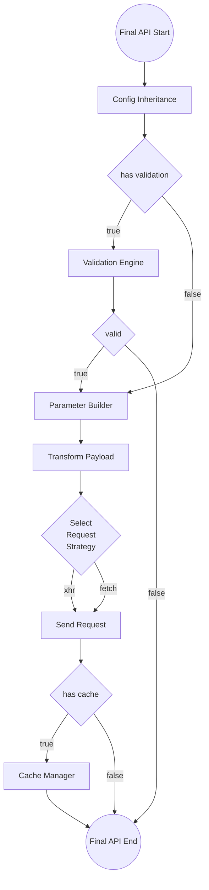

# Final API

The "final API" is a method set within the `api` property of a karman node configured through `defineAPI`. It behaves similarly to the karman tree in terms of inheritance and overriding. The final API records the configuration provided by `defineAPI` during initialization and then references the configuration of the parent karman node at runtime before overriding it with the recorded configuration.

- [Final API](#final-api)
  - [Syntax](#syntax)
  - [Flow](#flow)
  - [Request Strategy](#request-strategy)
  - [Parameter Definition](#parameter-definition)

Final APIs can also choose to configure either a complete URL or a URL fragment. When there are only a few APIs scattered on a particular route, it may be considered to configure them on the parent node without creating additional nodes, making the route configuration more flexible.

```js
import { defineKarman, defineAPI } from "@vic0627/karman";

export default defineKarman({
  root: true,
  url: "https://karman.com/products",
  api: {
    getAll: defineAPI(),
    // The URL for this final API is "https://karman.com/products/categories"
    getCategories: defineAPI({
      url: "categories",
    }),
  },
});
```

## Syntax

When calling a final API, unlike a typical HTTP client, the final API itself is a synchronous task. It first performs tasks such as parameter validation, parameter construction, initialization of request data and configuration, and then returns a Promise for the client to wait for the response result along with a method to cancel the request. The client needs to wait for the Promise to be fulfilled before getting the response result.

```js
const [resPromise, abort] = finalAPI(payload[, config])
```

- `resPromise`: The response result, which is a Promise object. It can be used to retrieve data using async/await or Promise chaining.
- `abort`: The method to cancel the request, which is a synchronous task.
- `payload`: The main parameter object accepted by the final API. It should have the attributes determined by payloadDef when defining the final API. If the required parameters are not defined in payloadDef but there is a need to set config when calling the final API, payload can be passed as an empty object, `undefined`, `null`, or similar values.
- `config`: The parameter to overwrite the final API configuration. However, it cannot overwrite initial configurations such as url, method, payloadDef, etc.

## Flow

This is the flowchart of the Final API execution. Below are explanations of some underlying logics, and nodes that have already been explained in separate sections will not be mentioned again:



- Config Inheritance: The configuration inheritance and overwriting of Final API can be divided into several stages.
  1. defineAPI configuration: At this stage, the received configuration is temporarily stored to provide subsequent inheritance and overwriting.
  1. Runtime configuration: When the final API is called, there is an opportunity to provide the final overwriting configuration. If a configuration is received, it will be temporarily stored first.
  1. First-stage inheritance: At this stage, the runtime configuration is compared with the temporarily stored runtime configuration. If the configurations are the same between the two times, the inheritance behavior of this stage will be skipped; otherwise, the runtime configuration will overwrite the defineAPI configuration.
  1. Second-stage inheritance: At this stage, the configuration of the karman node to which the final API belongs is referenced, and the configuration inherited from the first stage is used for overwriting, thus obtaining the final configuration of the final API.
- Parameter Builder: At this stage, the final request URL and payload will be constructed based on the payload of the Final API. The payload here will always maintain the type of `Record<string, any>`.
- Transform Payload: At this stage, the payload will be transformed into the required type for the formal request, such as `string`, `FormData`, and so on.

## Request Strategy

The requestStrategy attribute can determine the HTTP Client used by the final API. Currently, it supports "xhr" and "fetch" as parameters, with "xhr" being the default option.

```js
import { defineKarman, defineAPI } from "@vic0627/karman";

export default defineKarman({
  root: true,
  url: "https://karman.com/products",
  api: {
    // This method will use the default XMLHttpRequest as the HTTP Client
    getAll: defineAPI(),
    // This method uses fetch as the HTTP Client
    getCategories: defineAPI({
      url: "categories",
      requestStrategy: "fetch",
    }),
  },
});
```

> [!WARNING]
> Different request strategies have different response formats, so it's important to be cautious when handling response data.

## Parameter Definition

When defining the parameters required for a method, you can use the payloadDef attribute. The key is the parameter name, and the value is the relevant definition for that parameter, including where the parameter should be used, whether it's required, and the [validation rules](./validation-engine.md) for the parameter.

First, determine where the parameter should be used by using the `position` attribute. The acceptable values are:

- `"path"`: Specifies the parameter as a path parameter, defined in the url attribute using the format `:parameterName`.
- `"query"`: Appends the parameter to the URL as a query parameter in the format `parameterName=parameterValue`.
- `"body"`: Uses the parameter in the request body. Similar to `"query"`, the key will use the name defined in the `payloadDef`.

These types can be assigned as a `string[]` to the `position` attribute, indicating that the same parameter can be used in different parts of the request. For example, `position: ["path", "body"]` means that this parameter is used in both the path parameter and the request body.

Next, decide if the parameter is required by using `required: boolean`. It's important to note that validating if a parameter is required is part of the validation engine. `required` is not placed inside `rules` but must be set to `true` in the `validation` attribute of a parent node or API configuration to activate the validation mechanism.

> [!WARNING]
> The `required` validation checks if the parameter key exists in the `payload` using the `in` operator and does not mean the parameter can be `undefined`.

Finally, the explanation for parameter validation rules is complex and thus explained in a separate section.

```js
import { defineKarman, defineAPI } from "@vic0627/karman";

const karmanProduct = defineKarman({
  root: true,
  url: "https://karman.com/products",
  validation: true, // Activate validation engine for this node
  api: {
    getAll: defineAPI({
      payloadDef: {
        limit: {
          position: "query", // Non-required parameter "limit" used as a query parameter
        },
      },
    }),
    getById: defineAPI({
      url: ":id/:category",
      payloadDef: {
        id: {
          required: true,
          position: "path", // Required parameter "id" used in the URL path
        },
        category: {
          // Non-required parameter "category" used in both path and query
          position: ["path", "query"],
        },
      },
    }),
  },
});

karmanProduct.getALL(); // url: https://karman.com/products
karmanProduct.getALL({ limit: 10 }); // url: https://karman.com/products?limit=10
karmanProduct.getById(); // ValidationError
karmanProduct.getById({ id: 10 }); // url: https://karman.com/products/10
karmanProduct.getById({
  // url: https://karman.com/products/10/clothes
  id: 10,
  category: "clothes",
});
```

For default parameter values, you can set them using the `defaultValue` attribute, which must be a method. The return value of this method will be used as the default value for the parameter.

Additionally, if validation rules are set, default values will also be validated by the validation engine. Therefore, you cannot assign default values that do not comply with the validation rules, ensuring the correctness of the parameters.

```js
const setDefault = defineAPI({
  // ...
  validation: true,
  payloadDef: {
    param01: {
      rules: "char",
      // defaultValue: () => "Hi", // => ValidationError
      defaultValue: () => "K",
    },
  },
});
```

Lastly, if all parameters are intended for the request body without additional validation rules or default values, you can use `string[]` to replace the original `payloadDef` object. However, this will cause the API to lose advantages such as auto-completion during development:

```js
const lazyPayload = defineAPI({
  payloadDef: ["name", "gender", "age"],
});

lazyPayload({
  name: "Karman",
  gender: "none",
  age: 1,
});
```

**Supplementary: Reusing Parameter Definitions**

In many cases, multiple sets of APIs may use identical parameters. In such situations, it's advisable to abstract the parameter definitions and encapsulate them using a factory approach. This allows for optional parameters and their positions to be passed in, enabling greater flexibility in configuration while maintaining consistent validation rules.

Additionally, utilizing JSDoc for type annotations and comments can make the definition objects produced by the factory more type-friendly.

```js
// /payload-def/id.js
/**
 * Identifier definition factory
 * @param {R} required - Whether it's required
 * @param {import('@vic0627/karman').ParamPosition[]} [position] - Parameter position
 * @template {boolean} R
 */
export default (required, position = ["body"]) => ({
  /**
   * Identifier
   * @min 1
   * @type {R extends true ? number : (number | void)}
   */
  id: {
    required,
    position,
    rules: ["int", { min: 1 }],
  },
});
```
