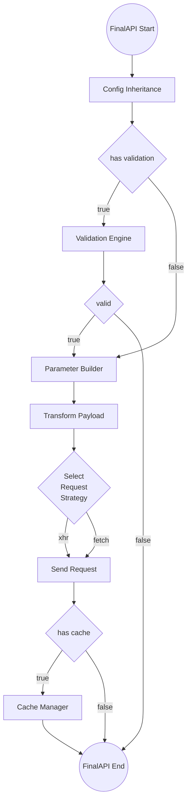

# Final API

- [Final API](#final-api)
  - [語法](#語法)
  - [程式流](#程式流)
  - [請求策略](#請求策略)
  - [參數定義物件](#參數定義物件)

「FinalAPI」是透過 `defineAPI()` 設置於 karman node 的 `api` 內的方法，且與 karman tree 同樣會有繼承與複寫的行為，final API 會在初始化時先記錄由 `defineAPI()` 給予的配置，並在運行時引用所屬 karman node 的配置後再以初始化時紀錄的配置進行複寫。

final API 同樣可以選擇配置 url 或 url 的片段，當今天某路由上可能只有零星幾個 API 時，可以考慮將他們配置到父節點上，而不用另外在建立新的節點，讓路由的配置可以更彈性。

```js
import { defineKarman, defineAPI } from "@vic0627/karman";

export default defineKarman({
  root: true,
  url: "https://karman.com/products",
  api: {
    getAll: defineAPI(),
    // 此 final API 的 url 是 "https://karman.com/products/categories"
    getCategories: defineAPI({
      url: "categories",
    }),
  },
});
```

## 語法

在調用 FinalAPI 時，與一般 HTTP Client 不同，FinalAPI 本身是同步任務，會先進行如：參數驗證、參數構建、初始化請求所需資料與配置等任務，並返回用戶端一個等待響應結果的 Promise 與一個取消請求方法，用戶端需要另外等待該 Promise fulfilled 之後，才會拿到該次響應結果。

```js
const [resPromise, abort] = karman.finalAPI(payload[, config])
```

- `resPromise`：響應結果，本身為一個 Promise 物件，可用 async/await 或 Promise chain 來獲取資料。
- `abort`：取消請求方法，是同步任務。
- `payload`：FinalAPI 主要接收的參數物件，為定義 FinalAPI 時透過 payloadDef 來決定此物件須具備甚麼屬性參數，倘若 payloadDef 並未定義所需參數，調用 final API 時又有設定 config 的需求時，payload 可傳入空物件、undefined、null 等值。
- `config`：最後複寫 API 配置的參數，但無法複寫如：url、method、payloadDef 等初始配置。

## 程式流

這是 Final API 執行時的流程圖，下面會針對一些底層邏輯進行解釋，而已經以獨立章節說明的節點就不額外點出來了：



- Config Inheritance：FinalAPI 的配置繼承與複寫又可分為幾個階段。

  1. defineAPI 配置：此階段會先暫存接收到的配置，提供後續的繼承與複寫。
  1. runtime 配置：FinalAPI 被呼叫時會提供最後複寫配置的機會，若有接收到配置，會先進行暫存動作。
  1. 第一階段繼承：此階段會先比較 runtime 配置與暫存的 runtime 配置，若前後兩次的配置相同，會略過此階段的繼承行為，否則以 runtime 配置複寫 defineAPI 的配置。
  1. 第二階段繼承：此階段會引用 FinalAPI 所屬 karman node 的配置，並以第一階段繼承後的配置進行複寫，進而獲得 FinalAPI 的最終配置。

- Parameter Builder：此階段將會依據 FinalAPI 的 payload 來建構最終請求的 url 與 payload，這邊的 payload 始終會維持 `Record<string, any>` 的型別。
- Transform Payload：此階段將會轉換 payload 至正式請求所需的型別，如 `string`、`FormData` 等等。

## 請求策略

`requestStrategy` 屬性可以決定該 FinalAPI 所選用的 HTTP Client，目前支援 `"xhr"` 與 `"fetch"` 作為參數，並以 `"xhr"` 為預設選項。

```js
import { defineKarman, defineAPI } from "@vic0627/karman";

export default defineKarman({
  root: true,
  url: "https://karman.com/products",
  api: {
    // 此方法將使用預設的 XMLHttpRequest 作為 HTTP Client
    getAll: defineAPI(),
    // 此方使用 fetch 作為 HTTP Client
    getCategories: defineAPI({
      url: "categories",
      requestStrategy: "fetch",
    }),
  },
});
```

> [!WARNING]
> 不同的請求策略有不同的響應格式，在處理響應的資料上需要注意。

## 參數定義物件

在定義該方法所需的參數時可以透過 `payloadDef` 屬性，key 是參數名稱，value 是該參數的相關定義，相關定義包括：該參數要用在哪裡、是否為必要參數、[參數的驗證規則](./validation-enigine.md)。

首先決定該參數要用在哪裡，可以透過 `position` 屬性來決定，以下是可接受值：

- `"path"`：指定為路經參數，需在 `url` 屬性中以 `:參數名` 的格式定義參數的確切位置。
- `"query"`：會以 `參數名=參數值` 的格式串接 url 的查詢參數。
- `"body"`：會將參數用於請求體中，與 `query` 相同的是，key 都會採用 `payloadDef` 中所定義的名稱。

以上類型可以用 `string[]` 賦予 `position`，代表同一參數可以用在請求中的不同地方，例如 `position: ["path", "body"]` 代表此參數同時用於路徑參數與請求體中。

接下來決定參數是否必須，可以透過 `required: boolean` 來設置，但要注意的是，驗證參數是否為必須的行為，屬於驗證引擎的一環，但因設計上的考量沒有將 `required` 放在 `rules` 內，因此必須在該 FinalAPI 上的某個父節點或 API 配置本身將 `validation` 設置為 `true` 來啟動驗證機制。

最後在[參數驗證規則](./validation-enigine.md)的部分較為複雜，因此以獨立章節來解說。

```js
import { defineKarman, defineAPI } from "@vic0627/karman";

const karmanProduct = defineKarman({
  root: true,
  url: "https://karman.com/products",
  validation: true, // 先啟動該節點的驗證引擎
  api: {
    getAll: defineAPI({
      payloadDef: {
        limit: {
          position: "query", // 非必要參數 limit 將用在查詢參數
        },
      },
    }),
    getById: defineAPI({
      url: ":id/:category",
      payloadDef: {
        id: {
          required: true,
          position: "path", // 必要參數 id 將用於 url 中的變數
        },
        category: {
          // 非必要參數 category 將用於路徑中的變數與查詢參數
          position: ["path", "query"],
        },
      },
    }),
  },
});

karmanProduct.getALL(); // url: https://karman.com/products
karmanProduct.getALL({ limit: 10 }); // url: https://karman.com/products?limit=10
karmanProduct.getById(); // ValidationError
karmanProduct.getById({ id: 10 }); // url: https://karman.com/products/10
karmanProduct.getById({
  // url: https://karman.com/products/10/clothes
  id: 10,
  category: "clothes",
});
```

在參數預設值的部分，可以通過 `defaultValue` 屬性來設定，該屬性必須為一個方法，而方法的返回值將作為該參數的預設值使用。

另外，假設有設定驗證規則，預設值也會經過驗證引擎的驗證，所以你無法賦予不符合驗證規則的預設值給該參數，確保參數的正確性。

```js
const setDefault = defineAPI({
  // ...
  validation: true,
  payloadDef: {
    param01: {
      rules: "char",
      // defaultValue: () => "Hi", // => ValidationError
      defaultValue: () => "K",
    },
  },
});
```

最後，假設說**所有的參數接會用於請求體，且無其他驗證規則與預設值**，你是可以使用 `string[]` 來替代原有的 `payloadDef` 物件的，但這將會使 FinalAPI 失去自動完成等等開發上的優勢：

```js
const lazyPayload = defineAPI({
  payloadDef: ["name", "gender", "age"],
});

lazyPayload({
  name: "Karman",
  gender: "none",
  age: 1,
});
```

**補充：復用參數定義**

> [!NOTE]
> Karman 已推出新的功能 [Schema API](./schema-api.md)，專門用來解決 `payloadDef` 復用的問題。

通常情況下，多組 API 可能會使用到重複的參數，這時可以考慮將參數的定義抽離出來，以工廠的方式將其封裝，提供可選及參數位置的傳入，使參數可以在相同驗證規則的情況下，做到更大彈性的配置。

此外，利用 JSDoc 完善型別註記與註解，可使工廠產出的定義物件更型別友善。

```js
// /payload-def/id.js
/**
 * 編號定義工廠
 * @param {R} required - 是否必要
 * @param {import('@vic0627/karman').ParamPosition[]} [position] - 參數位置
 * @template {boolean} R
 */
export default (required, position = ["body"]) => ({
  /**
   * 編號
   * @min 1
   * @type {R extends true ? number : (number | undefined)}
   */
  id: {
    required,
    position,
    rules: ["int", { min: 1 }],
  },
});
```
